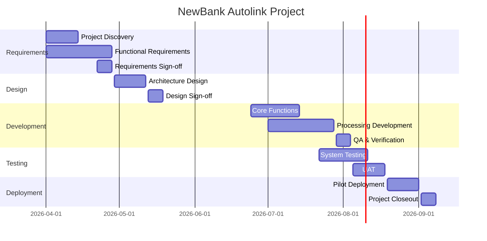

# PM
Project Management

```mermaid
gantt
    title NewBank Autolink Project
    dateFormat  YYYY-MM-DD

    section Requirements
    Project Discovery        :2026-04-01, 2026-04-14
    Functional Requirements  :2026-04-01, 2026-04-28
    Requirements Sign-off    :2026-04-22, 2026-04-28

    section Design
    Architecture Design      :2026-04-29, 2026-05-12
    Design Sign-off          :2026-05-13, 2026-05-19

    section Development
    Core Functions           :2026-06-24, 2026-07-14
    Processing Development   :2026-07-01, 2026-07-28
    QA & Verification        :2026-07-29, 2026-08-04

    section Testing
    System Testing           :2026-07-22, 2026-08-11
    UAT                      :2026-08-05, 2026-08-18

    section Deployment
    Pilot Deployment         :2026-08-19, 2026-09-01
    Project Closeout         :2026-09-02, 2026-09-08
```
